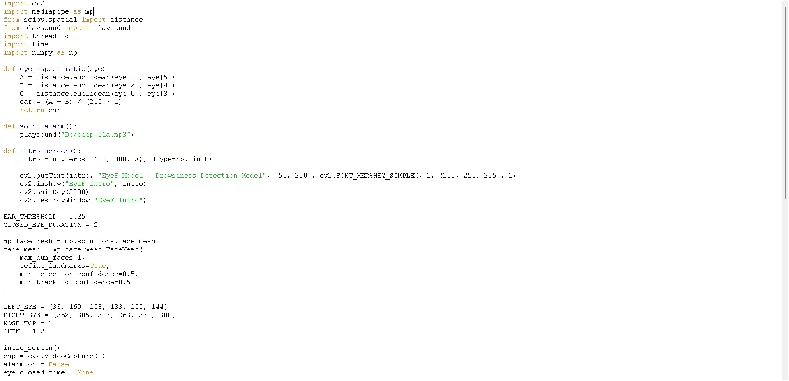
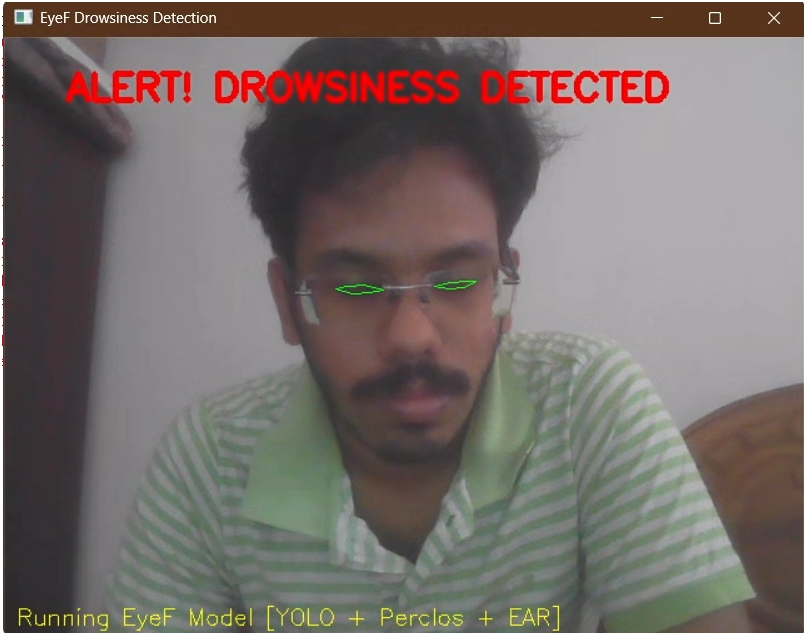

# 🚗 Driver-Somnolence-and-Lethargy-Detection-Model-based-on-Eyes-and-Facial-Movement


## 📌 Project Title  
**Driver Somnolence Detection: A Model Based on Eyes & Facial Movement Using OpenCV**

## 📝 Description  
This project detects driver drowsiness using computer vision techniques by analyzing eye closure and head posture. It leverages real-time video input to track the Eye Aspect Ratio (EAR) and head tilt angle, alerting the driver with an alarm if signs of drowsiness or fatigue are detected.

Developed as a final year B.Tech project in Artificial Intelligence and Data Science.

## 🔧 Technologies Used  

- Python 3.x  
- OpenCV (`cv2`)  
- MediaPipe (`mediapipe`)  
- YOLO (`ultralytics`)  
- NumPy (`numpy`)  
- SciPy (`scipy.spatial.distance`)  
- Playsound  
- Threading  
- Time  
- Math  

## 🚀 How to Run the Project  

1. **Clone the repository:**
   ```bash
   git clone https://github.com/yourusername/driver-drowsiness-detection.git
   cd driver-drowsiness-detection
2. **Install the dependencies**
```pip install -r requirements.txt```
3. **Run the project**
```python EyeF_model.py```
## 📸 Screenshot






The webcam will start and monitor drowsiness based on eye and head movement.

⚠**️ Make sure your webcam is functional and your Python environment is set up correctly.**
